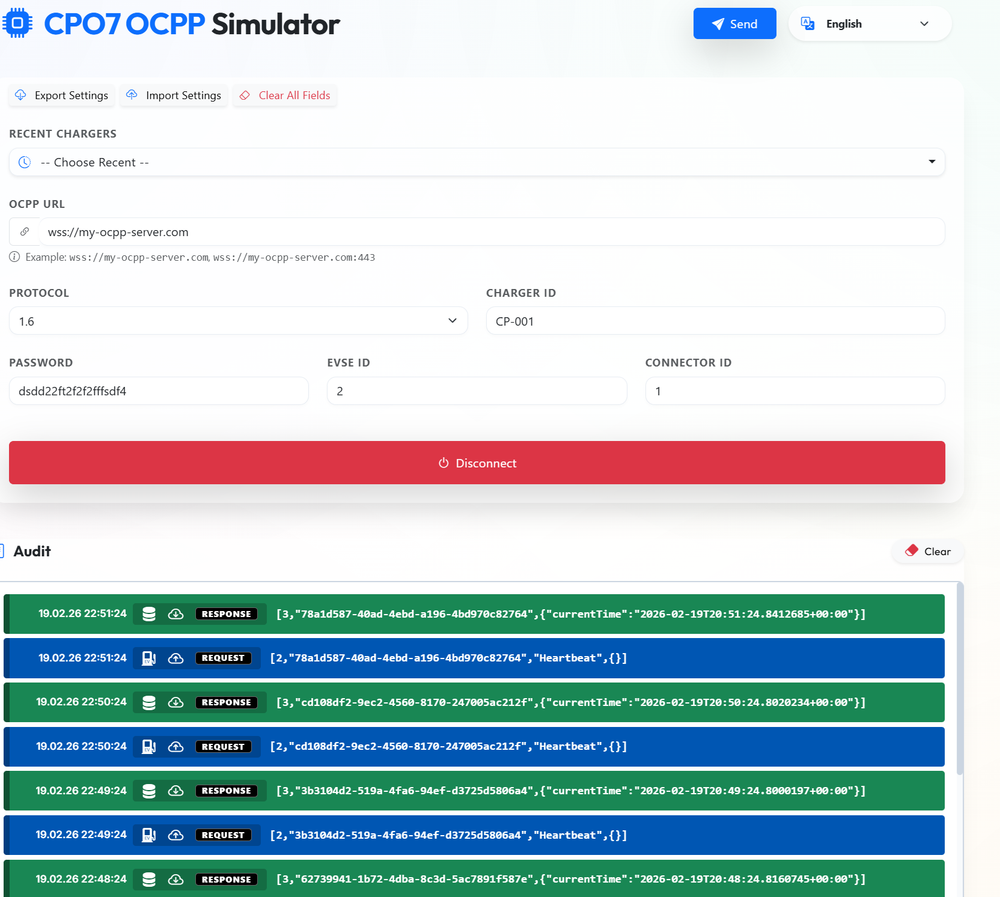
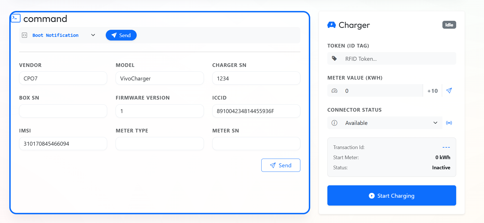

# CPO7 OCPP Simulator

This application allows you to simulate an Electric Vehicle (EV) charger using OCPP 1.6 and 2.0.1 protocols directly from your browser.

## **Important: Browser WebSocket Limitation**

**This simulator runs completely client-side in the browser.**

Due to standard browser security policies (CORS/XHR), JavaScript cannot modify the initial WebSocket handshake headers. This means **Authorization Headers cannot be sent** during the connection phase.

### **Server Requirement**

The server **MUST** support the Authorization parameter in the URL query string:
`?Authorization=Basic base64Encoded({chargerId}:{password})`

## Usage

---

**© 2026 CPO7 - PAID SOFTWARE. Unlicensed use or distribution is prohibited.**

1. **Open the Simulator**: Simply open the `CPO7 OCPP Simulator.html` file in any modern browser. No installation required.
2. **Configure Connection**:
   - Enter your Charger ID and Authorization Key.
   - Select the OCPP Protocol (1.6 or 2.0.1).
   - Enter the full WebSocket URL (e.g., `wss://my-ocpp-server.com`).
3. **Connect**: Click the "Connect" button.
4. **Send Commands**: Once connected, use the command dropdown to select and send OCPP messages like `BootNotification`, `StatusNotification`, `Heartbeat`, etc.
5. **View Logs**: Check the Audit Log below to see real-time request and response messages.

## System Requirements

- A modern web browser (Chrome, Edge, Firefox, Safari).
- An internet connection to reach your OCPP server.

---

**© 2026 CPO7 - PAID SOFTWARE. Unlicensed use or distribution is prohibited.**
